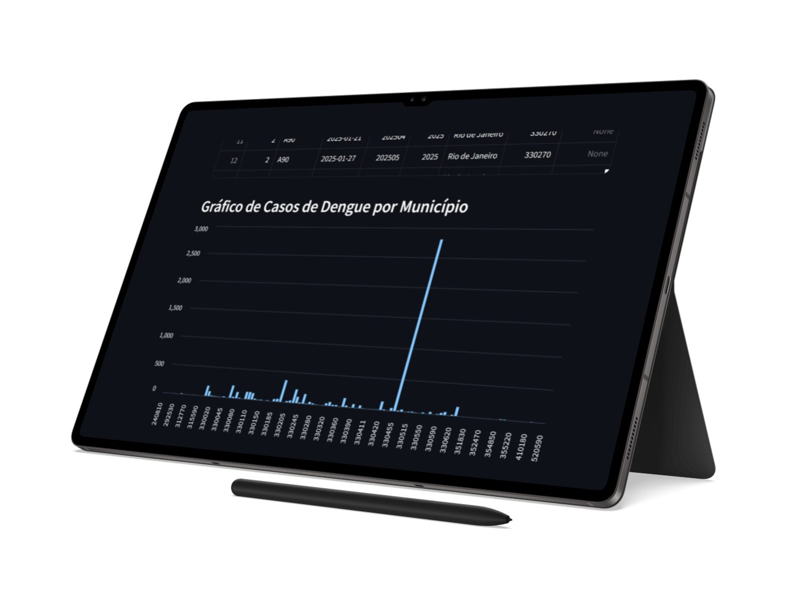
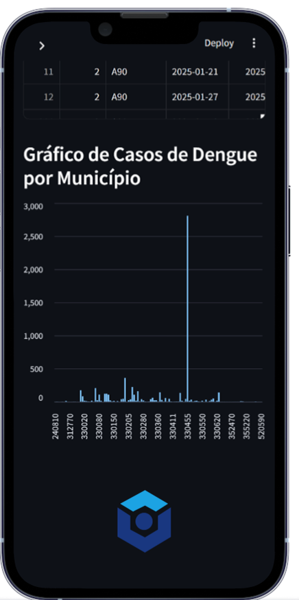

# Dengue Analysis - Streamlit App (2025)

This repository contains a **Streamlit application** for analyzing **Dengue cases in Rio de Janeiro (2025)**. The dataset includes detailed information about municipalities, case counts, and other important metrics related to the disease's spread.

## Table of Contents

1. [Overview](#overview)
2. [Features](#features)
3. [Dataset](#dataset)
4. [How to Use](#how-to-use)
5. [Run Locally](#run-locally)
6. [Screenshots](#screenshots)
7. [Contributions](#contributions)
8. [License](#license)

---

## Overview

This application provides an interactive dashboard to analyze Dengue cases in Rio de Janeiro in 2025. Users can filter data by municipality, view key statistics, and explore visualizations such as bar charts showing case distribution by municipality.

---

## Features

- **Filter by Municipality**: Select a municipality to view specific case details.
- **Dengue Case Analysis**: Visualize and analyze case distributions across municipalities.
- **Variable Descriptions**: View detailed descriptions of dataset columns.
- **User-Friendly Interface**: Simple and clean design with intuitive navigation.

---

## Dataset

The dataset contains information related to Dengue cases in 2025, including:

- Municipality codes and names
- Number of reported cases
- Patient information (age, gender, etc.)
- Symptom data (fever, headache, etc.)
- Test results and diagnostic data

---

## How to Use

1. **Select a Municipality**: Use the dropdown menu to choose a municipality and view its Dengue case data.
2. **View Statistics**: The application will display relevant statistics and charts for the selected municipality.
3. **Explore Variable Descriptions**: Access detailed explanations of each variable from the sidebar.

---

## Run Locally

To run this app locally, follow the steps below:

### Prerequisites

1. Install Python 3.7+ (if not already installed).


0. Install dependencies from `requirements.txt`:
    ```bash
    pip install -r requirements.txt

1. Clone this repo:
    ```bash
    git clone https://github.com/yourusername/dengue-analysis-app.git
    cd dengue-analysis-app

2. Run the app:
    ```bash
    streamlit run app.py

3. Open the app in your browser at http://localhost:8501.

## Screenshots

Here are some screenshots of the application:







## Contributing

Contributions are welcome! If you'd like to contribute to this project, follow these steps:

1. Fork the repository.
2. Create a new branch (`git checkout -b feature-name`).
3. Commit your changes (`git commit -am 'Add new feature'`).
4. Push to the branch (`git push origin feature-name`).
5. Create a new Pull Request.

Please make sure your code follows the project's coding standards and includes tests where necessary. Thank you for contributing!

## License

This project is licensed under the MIT License - see the [LICENSE](LICENSE) file for details.

<p align="center">
  
</p>